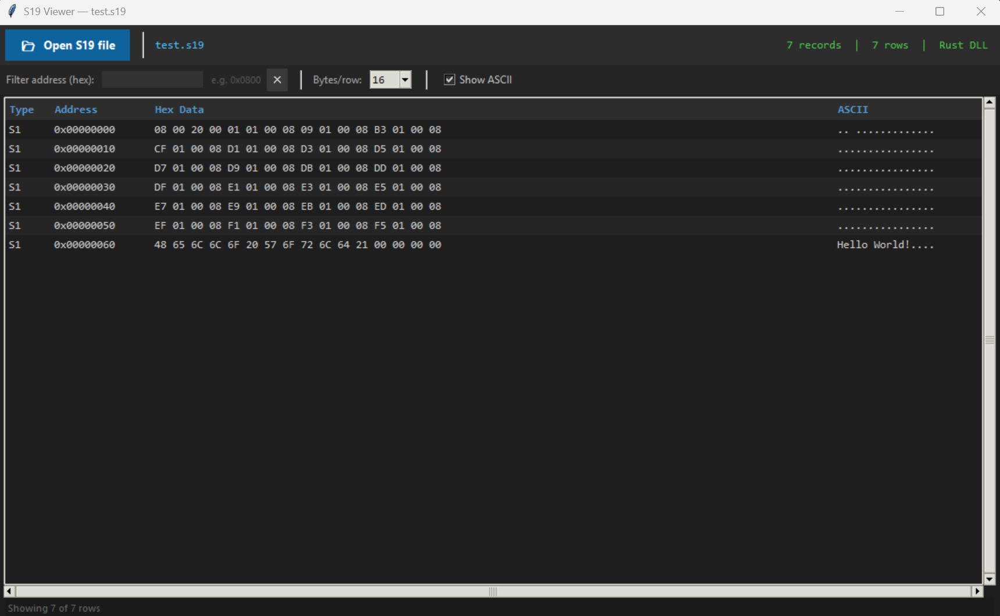
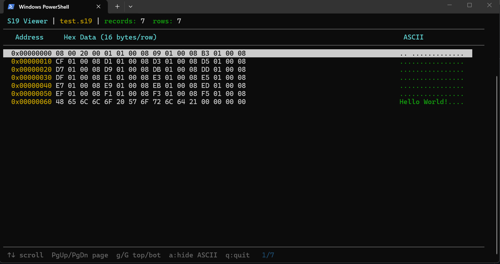

# S19 Viewer - Rust usage within Python scripts

An efficient S19 file viewer combining the performance of **Rust** with the user-friendly interface of **Python**. This hybrid application leverages:

- **Rust** for fast S19 file parsing (compiled as a native library)
- **Python** for the graphical user interface
- A command-line interface for direct execution without GUI

This tool allows you to parse, visualize, and analyze S19 (Motorola S-record) files. The application supports both interactive GUI mode and standalone command-line usage.

## Motivation

This repro was developed as a learning project to enhance understanding of implementing and using **Rust functions within other programming languages**. By combining the performance benefits of Rust with Python's ease of use, it demonstrates practical techniques for:

- Creating language bindings between Rust and Python
- Building efficient native libraries in Rust
- Leveraging the strengths of multiple languages in a single project

It serves as both a functional S19 viewer tool and an educational resource for anyone interested in Rust-Python interoperability.

## Features

-  **S19 Parsing**: Rust-based parser for fast and reliable S19 file processing
- **Python tkinter GUI**: Python-based graphical interface for easy visualization
- **CLI Support**: Command-line executable for automated workflows

## Prerequisites

Before getting started, ensure you have the following installed:

- **Python 3.x** – For the GUI component
- **Rust** – For building the project
- **Cargo** – Rust's package manager (installed with Rust)

### Setting Up the Rust Toolchain

For Windows development, you'll need the GNU toolchain:

```bash
rustup target add x86_64-pc-windows-gnu
```

## Getting Started

### 1. Clone the Repository

```bash
git clone https://github.com/Sch-Stef/s19viewer.git
cd s19viewer
```

### 2. Build the Project

```bash
cargo build
```

This will compile the Rust parser library and create the executable.

## Usage

### Option A: GUI Application

Launch the graphical interface with your S19 file:

```bash
python s19viewer.py test.s19
```

This opens an interactive window where you can visualize and analyze your S19 file.

**GUI Example:**


### Option B: Command-Line Executable

Run the compiled executable directly from the command line:

```bash
.\target\x86_64-pc-windows-gnu\debug\s19viewer.exe test.s19
```

This is ideal for integration into scripts or automated workflows.

**CLI Example:**


## Project Structure

```
s19viewer/
├── .cargo/
│   └── config.toml                     # Toolchain details
├── docs/
│   ├── fallback-solution.md            # Explanation of the fallback solution
│   ├── parsing-functionality.md        # Explanation of the parsing functionality
│   └── rust-python-integration.md      # Explanation of the rust implementation within python
├── src/
│   ├── main.rs                         # CLI executable entry point
│   └── lib.rs                          # Rust library (shared parser logic)
├── s19viewer.py                        # Python GUI implementation
├── test.s19                            # Sample S19 file for testing
├── Cargo.toml                          # Rust project manifest
└── README.md                           
```

## Architecture

The project is structured as a Rust library with a Python binding:

- **Rust Component** (`lib.rs`): Handles all S19 file parsing logic.
- **Python GUI** (`s19viewer.py`): Provides an accessible interface to the Rust parser.
- **CLI Binary** (`main.rs`): Standalone executable that doesn't require Python and can be directly called with the generated .exe file that is created during the 'cargo build'.


## Testing

A sample S19 file (`test.s19`) is included for testing and demonstration purposes. You can use this to verify your installation:

```bash
python s19viewer.py test.s19
# or
.\target\x86_64-pc-windows-gnu\debug\s19viewer.exe test.s19
```

## Documentation

For a deeper understanding of the project's implementation details, see the comprehensive documentation:

- **[Fallback Solution](docs/fallback-solution.md)** – How the application handles missing Rust DLL and automatically falls back to Python implementation with code examples.
- **[Rust-Python Integration](docs/rust-python-integration.md)** – Detailed explanation of language bindings, how Rust functions are exposed as C API, ctypes configuration, and memory management. ( The Rust -> C -> Python ctypes link is crucial! )
- **[S19 Parsing Functionality](docs/parsing-functionality.md)** – Deep dive into S19 file format, step-by-step parsing logic in both Rust and Python, with examples and common issues.

## License

See [LICENSE](LICENSE) for licensing information.

---

